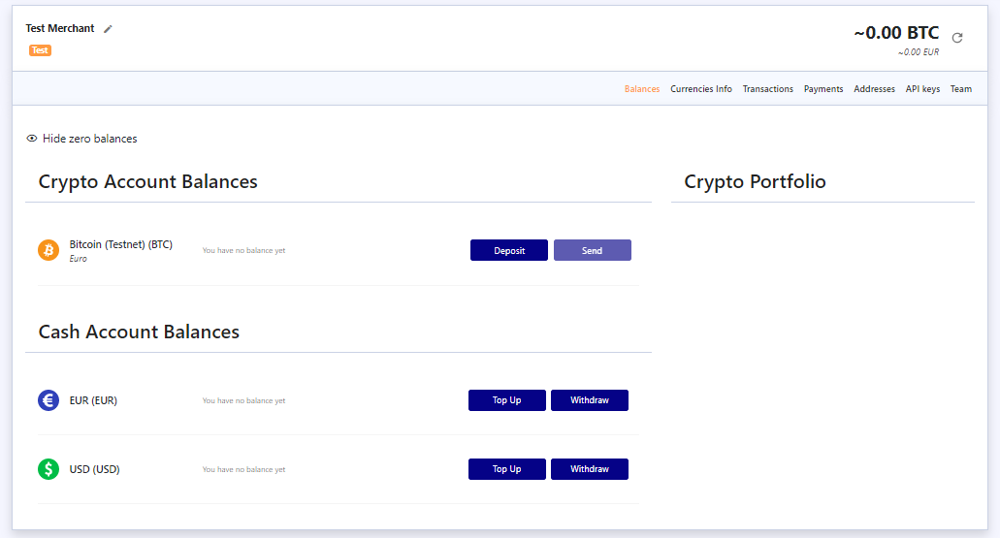
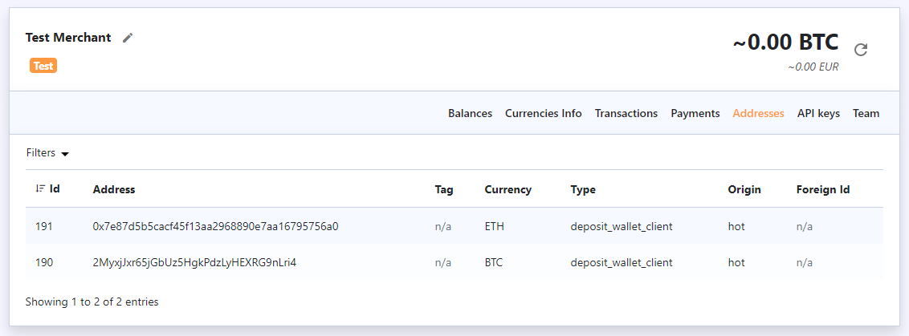
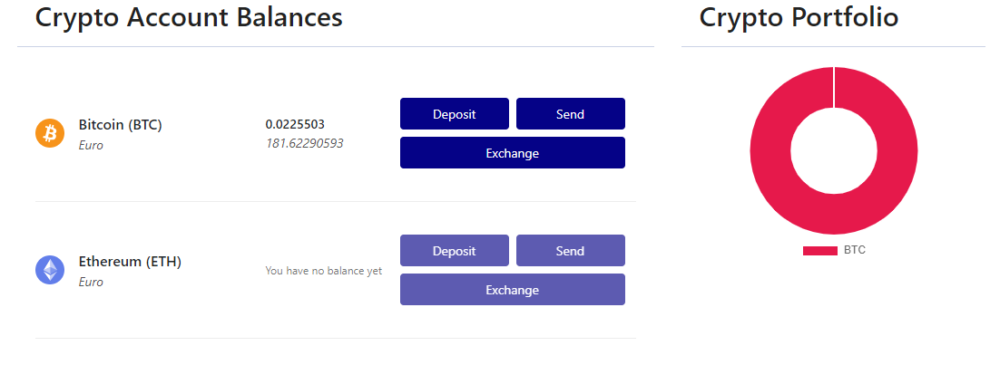

# Account Balance and Addresses

It is important to differentiate addresses for adding funds to your merchant balances from the ones that you generate for your users. You can see your merchant address by pressing the “Deposit” button. You get a unique address for each active currency.



You can use the “Addresses” tab to see the deposit addresses you’ve generated via our API by using the  following request:

```text
 https://app.coinspaid.com/api/v2/addresses/take
```



Also, the user with the “Owner” role can exchange or transfer funds directly via our back office, which makes such operations even more convenient for you.




