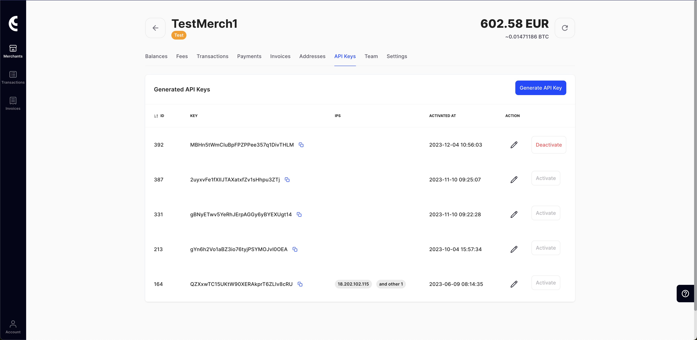
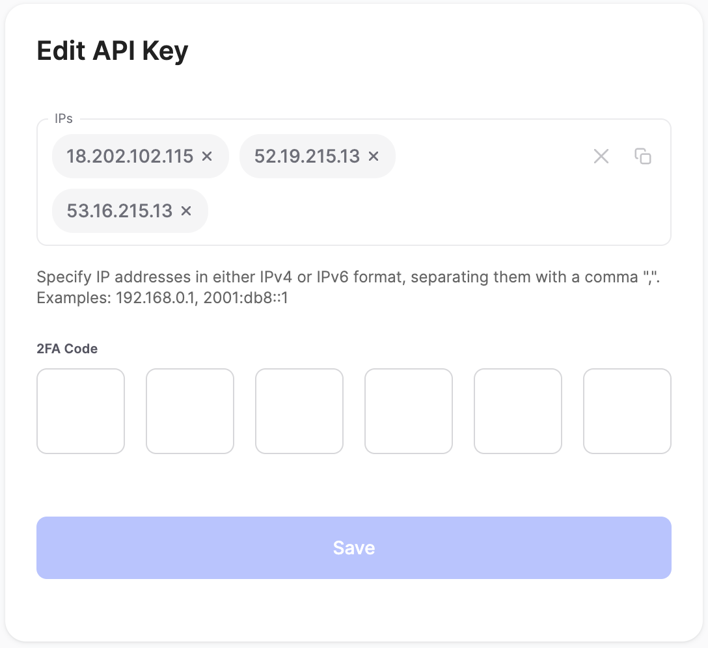

# API Set Up Stage

## API Set Up Stage

The following actions are required before you can make [API calls](../api-documentation/api-reference.md) to CoinsPaid.

Go to the **API keys** menu where you can activate your API key (or create a new one).

You will receive your **API secret** — the access code for the API key that you have activated. You will need to copy and save the secret key in a safe place because it is displayed **only once** and you will not be able to see it again.

<figure><figcaption></figcaption></figure>


The API secret is the most important security issue for the production environment. The secret grants access to funds management, so the person who owns the secret can transfer funds to any external addresses.


Now you need to set up the address for callbacks from the API. Callbacks are a means of communication with our API. The system sends callbacks for every transaction (deposit or withdrawal) and correct handling of these callbacks is essential for your day-to-day workflow. See the [Callbacks](../integration-guide/callbacks.md) page for more details.

You can specify the callback address by selecting the **Settings** tab. Then go to the **API** tab located in the top left corner and enter your URL. The system will send callbacks to this URL. Without completing this step, it is not possible to receive callbacks from us.

### Whitelisting IP addresses

As an additional layer of security, it is highly recommended to whitelist IP addresses for your API key. Whitelisting means that CoinsPaid will process API requests only from a certain list of IP addresses (the “white list”), while requests from any other IP addresses will be blocked. With this feature enabled, even if someone were to gain unauthorized access to your API key, they would not be able to use it unless they also gain access to a device with an IP address that you pre-approved.

Whitelisting is disabled by default. It is automatically enabled if you specify one or more IP addresses for the active API key.

To specify the IP addresses and enable whitelisting:

1. On the **API keys** tab, click the **Edit** button next to the active key.
2.  In the **IPs** field, enter a comma-separated list of IP addressed.

    Typically, you may want to whitelist the IP addresses of the servers where your e-commerce platform, payment gateway, or any system that integrates with CoinsPaid is hosted. If you use a cloud service or a hosting provider, you can obtain these IP addresses from your service provider's documentation or support team.

    Note that you **should not** specify your customers' IP addresses, but only the ones your own system controls.
3. Confirm the action by entering the 2FA code and clicking the **Save** button.

<figure><figcaption></figcaption></figure>

### Enabling currencies

Make sure that all necessary currencies are enabled in your merchant account. To do this, go to the **Currencies Info** tab. Here you can enable the currencies you want to use (either crypto or fiat) by clicking the **Add New Currency** button and selecting the desired currencies from the list.
