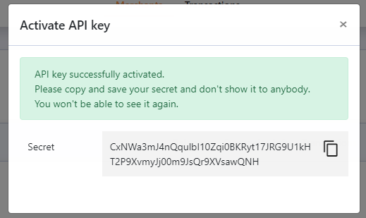

# API Set Up Stage

[Previous step is finished](introduction.md)? Are you browsing your merchant account?

Great! Now we can go to the next step – setting up the API.

Go over to the API keys menu, where you can activate your API key \(or create a new one\).

You will receive your **API secret** – an access code for the API key that you’ve activated. You’ll need to copy and save the key secret in a safe place because it is **only displayed once** and you won’t be able to see it again.


**Please note! The API secret is the most important security issue for the production environment. The secret grants access to funds management, hence the person with the secret may transfer funds to any external addresses.**


At this point you may whitelist IP addresses if necessary, to do so you need to press on the pencil button below IPs column.


Note. This step is optional, you don't need to whitelist specific IP addresses, in case you skip this step all IP addresses will be considered as whitelisted ones and no any restrictions will be applied in this regard.


Now you need to set up the address for callbacks from the API. Callbacks are a means of communication with our API. The system sends callbacks for every transaction \(deposit or withdrawal\) and correct handling of these callbacks is essential for your day-to-day workflow.   
  
You can set up this address by picking the "Settings" tab. 

Then go to the “API” tab located in the top right corner below your balance and set up your URL. You need to complete this step to receive callbacks from us, the system will send them to the URL that you set here.  
Also, you can change the API version here, although **v2 is used by default and we don’t recommend changing it.**

Make sure that all necessary currencies are enabled on your merchant account, for that you need to access the “Currencies Info" tab. Here you can enable the currencies that you want to use \(either crypto or fiat\) by pressing the “Add New Currency” button and picking the desirable currencies from the list

