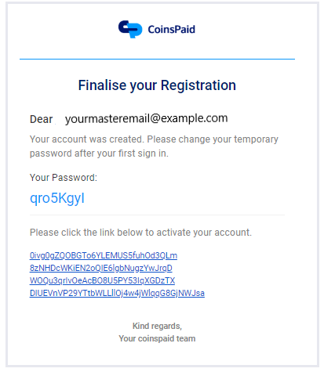

# Introduction

By following these instructions, you can easily set up your profile for tests and production.

We can provide you accesses to the following environments during your integration period:

[https://app.sandbox.cryptoprocessing.com/](https://app.sandbox.cryptoprocessing.com)– the introductory environment for testing the basic functionality of our API.

[https://app.cryptoprocessing.com/ ](https://app.cryptoprocessing.com)– the actual environment with real transactions. Intended for use in production.

Your master merchant account has the “Owner” role assigned to it by default. For more information, [see the “Team” tab instructions](user-permissions.md).


_Please note that multiple accounts can have the “Owner” role set up for one merchant, or one account can have this role established for multiple merchant accounts._


After that, we send you an invite to the e-mail address you’ve provided. An invite looks like this:\

Please click the link below the message to confirm your e-mail address.

After that, log into the system using your master e-mail and temporary password.

At this point you need to install the Google Authenticator app to your [Android](https://play.google.com/store/apps/details?id=com.google.android.apps.authenticator2\&hl=en) or [iOS](https://apps.apple.com/gb/app/google-authenticator/id388497605) device. We use 2FA (two-factor authentication) for all activities and changes in our system. This gives you an additional layer of security.

\
Set up the application either by using the provided Masterkey or scanning the QR code and entering the generated 2FA code. You will need to use the Authenticator every time our system requires you to enter such a code.

Once you’re logged in, you’ll need to reset the temporary password and create a new one.

