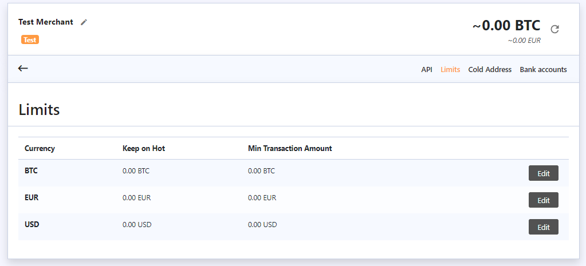
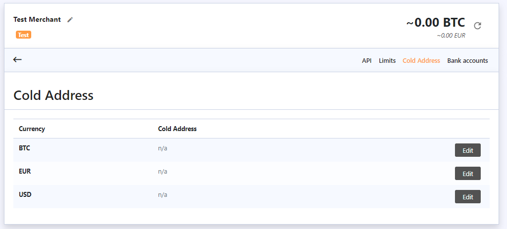

# Limits and Cold Addresses

The next important tab is “Limits”. Here, you can set the amount you wish to keep in your hot wallet \(i.e. your primary balance\) and the minimum transaction amount for moving funds to a separate cold wallet.

Once your balance reaches the “Keep on Hot” amount plus the minimum transaction amount, that difference will be moved to a cold address automatically. You can use these addresses or wallets to store the funds that you don’t need in your primary account.


Example: you set “Keep on Hot” to 1 BTC and “Min transaction Amount” to 0.1 BTC, as soon as the amount of your balance reaches 1.1 BTC in total, the exceeding amount \(0.1 BTC\) will be sent to your Cold Wallet automatically.


You can set up any addresses that you want to use as a cold one via the “Cold Addresses” tab. You can set up a Cold Address for each active currency.

