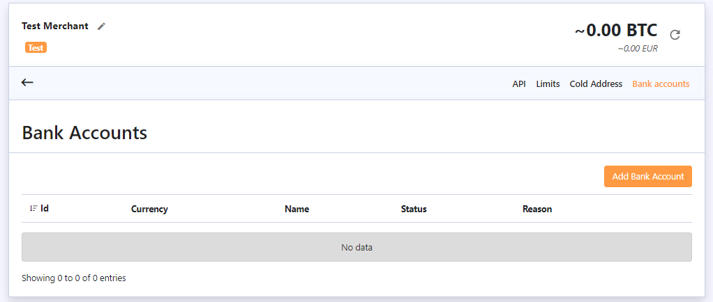

# Bank Accounts

The next tab is “Bank accounts”. Here you can add a bank account, but it needs to be approved by our team first. Once it’s done, you will be able to use this account to carry out transactions in fiat currency as our client or withdraw your fiat funds. 


_Please note, only you \(the merchant\) can operate with fiat funds, your users won’t be able to deposit or withdraw in fiat._


