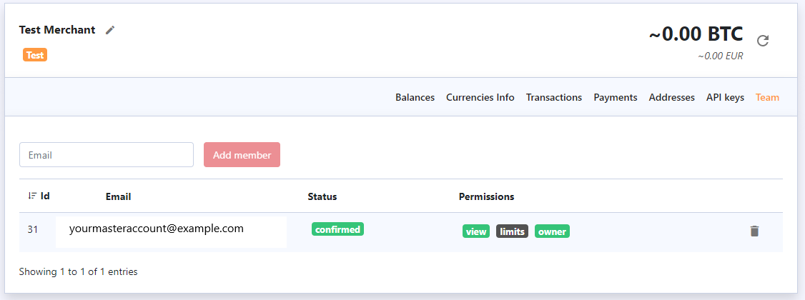

# User Permissions

By clicking the “Team” tab you can manage team permissions: add and remove members.

By default, newly added members only have permission to view сommon information like account balances, actual fees and transaction info but not to modify them. Your master account has the “Owner” role. It grants you access to all sensitive information \(API secret, cold wallet addresses, etc.\) and funds management.

You can share this role with other users or transfer it to another account if you need to, but this needs to be approved by us for security reasons. 


**Please, make sure the “Owner” role is only provided to the appropriate staff members as they will have the ability to access sensitive information.**


